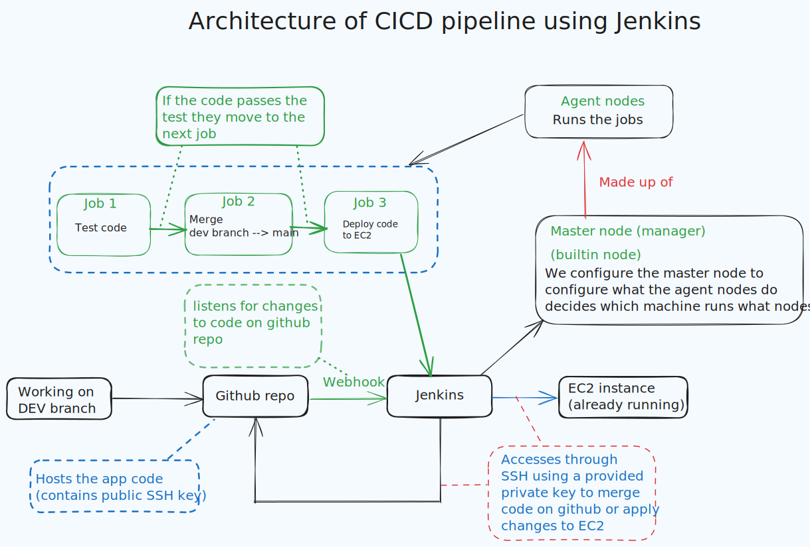
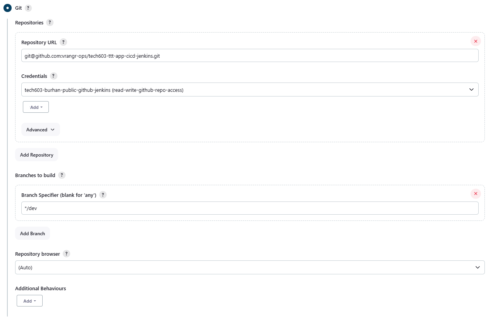
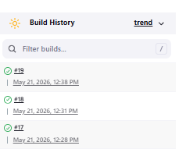
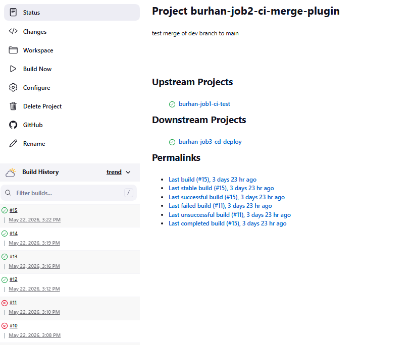
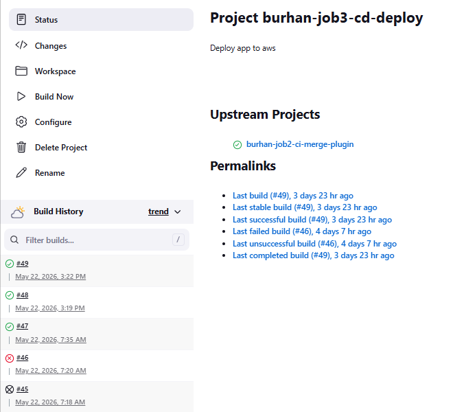
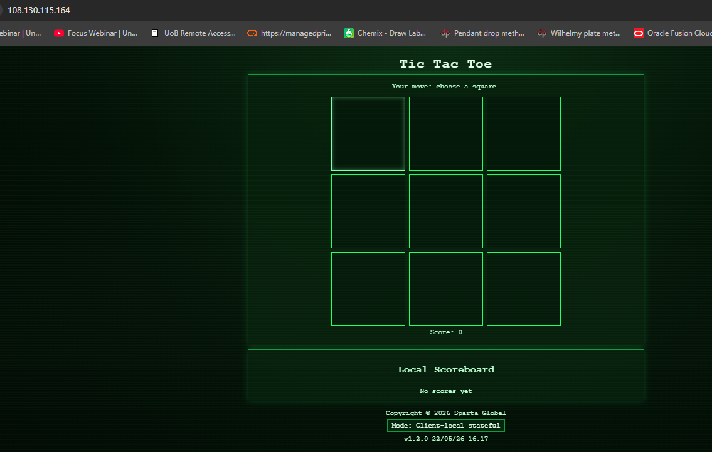
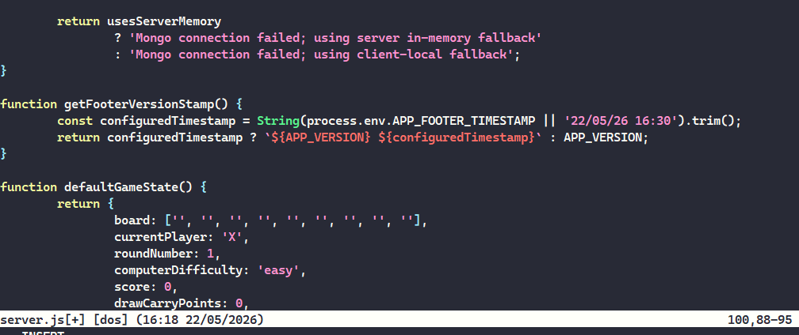
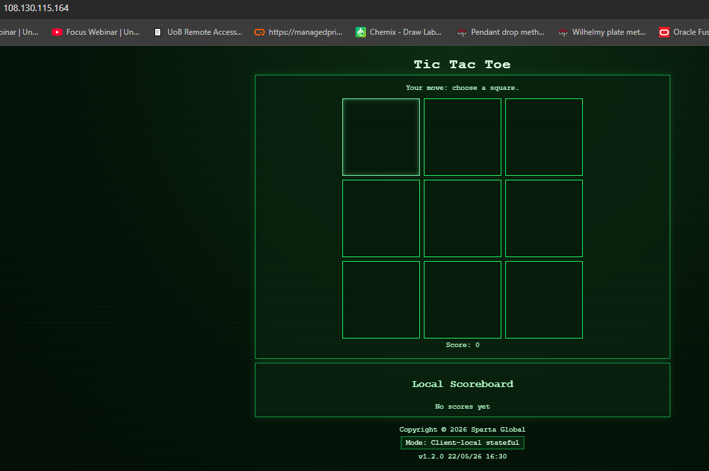

# Table of Contents

- [Table of Contents](#table-of-contents)
    - [CICD Pipeline architecture using jenkins](#cicd-pipeline-architecture-using-jenkins)
        
    - [Configure github webhook with jenkins (CI)](#configure-github-webhook-with-jenkins-ci)
        
        - [Creating webhook](#creating-webhook)
            
        - [Create the SSH key](#Create-the-SSH-key)
            
        - [Adding the public SSH key for github repo access](#Adding-the-public-SSH-key-for-github-repo-access)
            
    - [Merge github branches(CI) using jenkins](#Merge-github-branches(CI)-using-jenkins)
        
        - [Using git publisher plugin for merging dev branch to main (preferred method)](#using-git-publisher-plugin-for-merging-dev-branch-to-main-preferred-method)
    - [Deploying sparta app v1.2 to app running on EC2 using jenkins(CD)](#Deploying-sparta-app-v1.2-to-app-running-on-EC2-using-jenkins(CD))
        
    - [Testing pipeline](#testing-pipeline)
        

* * *

## CICD Pipeline architecture using jenkins

  

 
Why did we setup the CICD pipeline the way we did, benefits you have seen, benefits for an organisation?

*The CICD pipeline was split up into 3 jobs each run by a seperate agent node. The benefits of seperating the jobs were that the jobs could be run independantly of each other and the modular design means it can be adapted for other projects. Additionally, it means that issues can be more quickly identified if the task is broken down as the blocker will be apparent in the pipeline due to it halting the pipline, inhibiting the next job. A identification of issues is important for buisnesses as it allows problems to be tackled quicker.*

How did you setup each of your jobs (including authentication/security), webhook and how was the pipeline is triggered, what should the results be at the end?

*Authentication was done by giving jenkins access to private SSH keys to access the github repo as well as the EC2 instance running the app. The pipline was triggered an initial push to the dev branch which triggered the webhook, the deployment of the app was triggered by completion of a merge of the dev branch to main. The result at the end should be that edits to the dev branch should be deployed to the app running on the E2 instance.*

## Configure github webhook with jenkins (CI)

1.  Using a web browser navigate to the server via http://52.31.15.176:8080
    
2.  Login
    
3.  Select ---> new item
    
4.  Follow the configuration below;
    
    | Section | Setting |
    | --- | --- |
    | Project Name | burhan-job1-ci-test    freestyle project |
    | Build Retention | Keep max 5 builds |
    | GitHub Project | https://github.com/vrangr-ops/tech603-ttt-app-cicd-jenkins/ |
    | SCM Type | Git |
    | Repository URL | git@github.com:vrangr-ops/tech603-ttt-app-cicd-jenkins.git |
    | Credentials | Global credentials (SSH Username with Private Key)    ID and Username--> use SSH key name    paste private key      |
    | Branches to Build | \*/dev |
    | Build Triggers | GitHub hook trigger for GITScm polling |
    | Build Environment | NodeJS Installation: v20 |
    | Build Steps (Shell) | cd app    npm ci    npm test |
    

- npm ci is a command used in Node.js projects to install dependencies directly from the package-lock.json file, ensuring a clean and consistent installation of packages.
    
    - It is faster and more reliable than npm install, especially in automated environments like continuous integration.
- npm test is used to execute tests defined in your project  
     
    

**Connecting jenkins to github**  

### Creating webhook

1.  Navigate to github repository
2.  Settings
3.  Webhooks
4.  Add webhooks
5.  Paste in the URL of the jenkins server as the playload url with the webook extension
    - http://52.31.15.176:8080/github-webhook/
6.  Event trigger --> **just the push event**
7.  Save the webhook

&nbsp;

### Create the SSH key

1.  Using bash terminal navigate to `~/.ssh`
2.  Generate key RSA key

- `ssh-keygen -t rsa -b 4096 -C "your_email@example.com"`

3.  Initialise the agent and set up environment variable

- `eval "$(ssh-agent -s)"`

4.  Add the SSH private key to the ssh-agent

- `ssh-add ~/.ssh/github`

### Adding the public SSH key for github repo access

1.  Navigate to the repo
2.  Select --> settings
3.  Add deploy key
4.  Use the name of the SSH key --> `name-XXX-XXX-key.pub`
5.  Paste the public key
6.  Save

&nbsp;

## Merge github branches(CI) using jenkins

1.  Using a web browser navigate to the server via http://52.31.15.176:8080
2.  Login
3.  Select ---> **new item**
4.  Follow the configuration below;

| Section | Setting |
| --- | --- |
| Name | burhan-job2-ci-merge    freestyle project |
| Discard old builds | Max # of builds to keep : 5 |
| GitHub project | https://github.com/vrangr-ops/tech603-ttt-app-cicd-jenkins/ |
| Source Code Management     Repository URL    Add --> jenkins    Branches to build | Git    git@github.com:vrangr-ops/tech603-ttt-app-cicd-jenkins.git    Domain: Global credentials    SSH username with Private key---> paste key    \*/dev |
| Build Triggers | Build after other projects are built |
| Provide Node & npm bin/ folder to PATH | NodeJS Installation:v20    SSH agent               |
| SSH Agent | tech603-burhan-public-github-jenkins      |
| Build Steps | Execute shell;     git fetch origin   git checkout main   git pull origin main   git merge origin/dev --no-edit   git push origin main |

**Successful build**  

  

 

### Using git publisher plugin for merging dev branch to main (preferred method)

1.  Using a web browser navigate to the server via http://52.31.15.176:8080
    
2.  Login
    
3.  Select ---> new item
    
4.  Follow the configuration below;
    

| Section | Setting |
| --- | --- |
| Name | burhan-job2-ci-merge-plugin    freestyle project |
| Discard old builds | Max # of builds to keep : 5 |
| GitHub project | https://github.com/vrangr-ops/tech603-ttt-app-cicd-jenkins/ |
| Source Code Management     Repository URL    Add --> jenkins    Branches to build | Git    git@github.com:vrangr-ops/tech603-ttt-app-cicd-jenkins.git    Domain: Global credentials    SSH username with Private key---> paste key    \*/dev |
| Build Triggers | Build after other projects are built |
| Provide Node & npm bin/ folder to PATH | NodeJS Installation:v20    SSH agent |
| SSH Agent | tech603-burhan-public-github-jenkins |
| Post-build Actions | **Git Publisher;**    tick --> Push Only If Build Succeeds    tick --> Merge Results    Branch to push --> main    Target remote name --> origin |

&nbsp;

**Successful build**

****

## Deploying sparta app v1.2 to app running on EC2 using jenkins(CD)

1.  Using a web browser navigate to the server via http://52.31.15.176:8080
2.  Login
3.  Select ---> **new item**
4.  Follow the configuration below;

| Section | Setting |
| --- | --- |
| Name | burhan-job3-cd-deploy    freestyle project |
| Discard old builds | Max # of builds to keep : 5 |
| GitHub project | https://github.com/vrangr-ops/tech603-ttt-app-cicd-jenkins/ |
| Source Code Management | Git |
| Repository URL | git@github.com:vrangr-ops/tech603-ttt-app-cicd-jenkins.git |
| Add --> jenkins | Domain: Global credentials     SSH username with Private key---> select key |
| Branches to build | \*/dev |
| Build Triggers | Build after other projects are built |
| Provide Node & npm bin/ folder to PATH | NodeJS Installation:v20 |
| SSH Agent | add ---> tech503-burhan-aws.pem    tech603-burhan-public-github-jenkins    paste --> private key     |
| Build Steps | Execute shell;    \# 1. Copy the files   scp -o StrictHostKeyChecking=no -r app ubuntu@54.170.163.72:/home/ubuntu/repo/tech603-sparta-app/nodejs20-sparta-tictactoe-v1/    \# 2. ssh in   ssh -o StrictHostKeyChecking=no ubuntu@54.170.163.72 << 'EOF'     # Load environment to find node/npm/pm2     \[ -f ~/.bashrc \] && . ~/.bashrc      echo "Connected and starting remote tasks..."      # Navigate to app     cd /home/ubuntu/repo/tech603-sparta-app/nodejs20-sparta-tictactoe-v1/app      # start the app     pm2 kill     npm install     pm2 start index.js --name "sparta app"      echo "Deployment finished successfully."   EOF |

**Successful build**

&nbsp;

## Testing pipeline

Original timestamp  

1.  Navigate to the app folder using a bash terminal
2.  `git status`
3.  `git checkout origin dev`
4.  Edit the `server.js` file using text editor ---> save the file  

    

5.  `git add .`
6.  `git commit -m "timestamp change"`
7.  `git push origin dev`
8.  Navigate to the app instance by pasting the public IP using http from a web browser

